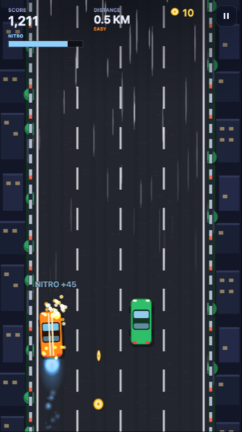
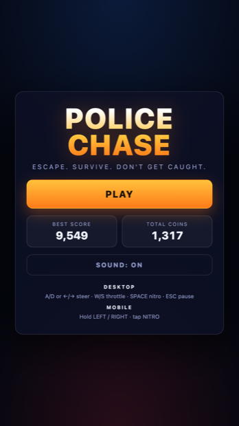
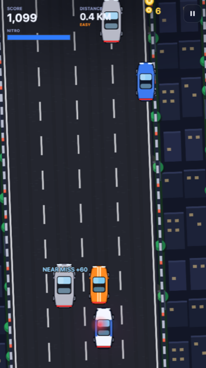
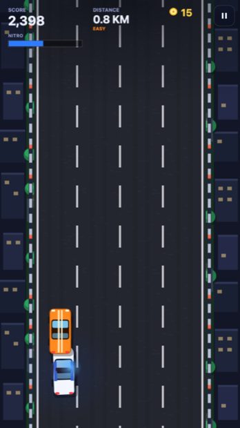
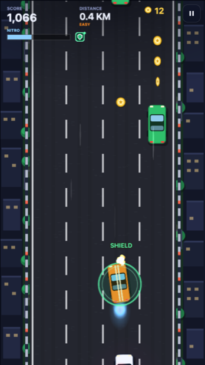
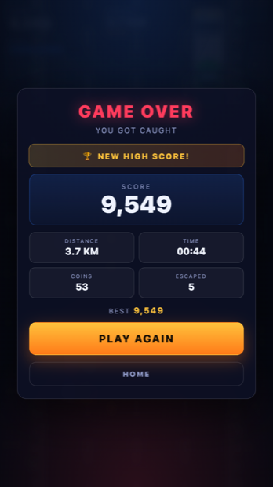
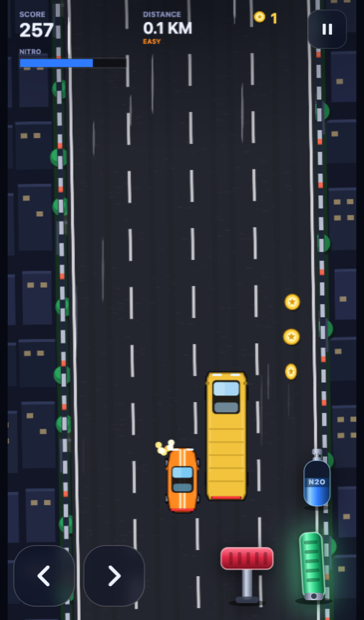
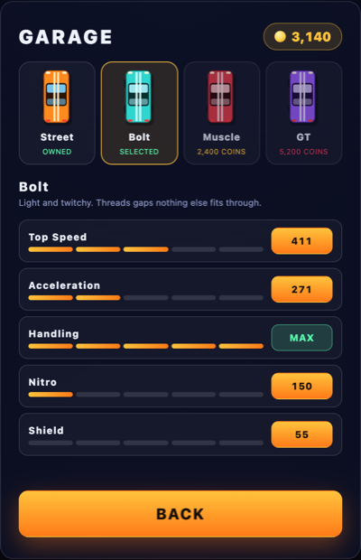
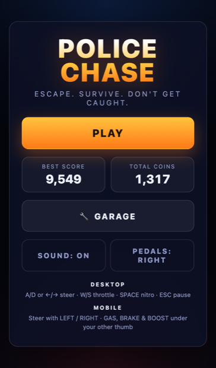

<div align="center">

# 🚓 POLICE CHASE

### *Escape. Survive. Don't Get Caught.*

**A fast, polished arcade escape game that runs in any browser.**
No install. No account. No downloads. Just hit **PLAY**.

<br>

[](https://www.typescriptlang.org/)
[](https://phaser.io/)
[](https://vitejs.dev/)
[](#-performance)
[](#-everything-is-procedural)

<br>



<br><br>

**`Drive`** → **`Dodge traffic`** → **`Outrun the cops`** → **`Grab coins`** → **`Burn nitro`** → **`Survive`**

</div>

---

## 📸 Screenshots

<div align="center">

<table>
<tr>
<td align="center" width="33%">
  <br>
  <b>Landing screen</b><br>
  <sub>Best score, coins, sound and pedal-side toggles</sub>
</td>
<td align="center" width="33%">
  <br>
  <b>The highway</b><br>
  <sub>Four lanes that bend, endless city, coin trails</sub>
</td>
<td align="center" width="33%">
  <br>
  <b>On your tail</b><br>
  <sub>Stay there 1.6s and you're busted</sub>
</td>
</tr>
<tr>
<td align="center">
  <br>
  <b>Nitro</b><br>
  <sub>Speed lines, exhaust plume, camera kick</sub>
</td>
<td align="center">
  <br>
  <b>Shield</b><br>
  <sub>Eats one hit that would have ended the run</sub>
</td>
<td align="center">
  <br>
  <b>Game over</b><br>
  <sub>Full run breakdown and a new personal best</sub>
</td>
</tr>
<tr>
<td align="center">
  <br>
  <b>Mobile</b><br>
  <sub>Steering one side, GAS / BRAKE / BOOST the other</sub>
</td>
<td align="center">
  <br>
  <b>Garage</b><br>
  <sub>Four cars and five upgrade tracks, bought with coins</sub>
</td>
<td align="center">
  <br>
  <b>Responsive</b><br>
  <sub>320px phones through to 4K desktops</sub>
</td>
</tr>
</table>

</div>

---

## ⚡ Quick start

```bash
npm install
npm run dev        # dev server with hot reload  →  http://localhost:5173
npm run build      # typecheck + production bundle into dist/
npm run preview    # serve the production build locally
```

`dist/` is a plain static folder. Drop it on Netlify, Vercel, GitHub Pages, S3,
nginx — anything. **There is no backend.**

---

## 🎮 Controls

<table>
<tr><th align="left">Action</th><th align="left">⌨️ Desktop</th><th align="left">📱 Mobile</th></tr>
<tr><td><b>Steer</b></td><td><code>A</code> <code>D</code> &nbsp;or&nbsp; <code>←</code> <code>→</code></td><td>hold <b>LEFT</b> / <b>RIGHT</b></td></tr>
<tr><td><b>Accelerate</b></td><td><code>W</code> &nbsp;or&nbsp; <code>↑</code></td><td>hold <b>GAS</b></td></tr>
<tr><td><b>Brake</b></td><td><code>S</code> &nbsp;or&nbsp; <code>↓</code></td><td>hold <b>BRAKE</b></td></tr>
<tr><td><b>Nitro</b></td><td><code>Space</code></td><td>hold <b>BOOST</b></td></tr>
<tr><td><b>Pause</b></td><td><code>Esc</code></td><td>HUD pause button</td></tr>
</table>

On touch, steering sits under one thumb and the **GAS / BRAKE / BOOST** cluster
under the other. Which side the pedals go on is a setting on the landing screen
(**PEDALS: LEFT / RIGHT**) and is remembered between sessions.

The boost control is the nitrous bottle itself: it drains as you spend charge,
fires a visible jet while boost is actually running, and greys out when there
is too little left to fire — so a press that does nothing always looks like a
press that does nothing.

---

## 🏁 How it plays

> **Speed is the whole game.** The road scrolls at whatever speed *you* are
> doing, traffic moves relative to you, and the police close the gap the moment
> you ease off. Braking keeps you safe from traffic and hands you to the cops.

| | |
|---|---|
| 🚨 **The chase** | Cruisers rubber-band — the further back one falls, the harder it pushes. One that's level with your bumper gets no bonus at all, so holding your speed is always the way out. |
| 🔒 **Getting caught** | A cruiser has to sit in your blind spot for **1.6 seconds**. Weaving, nitro and clean driving all break the lock. A warning bar fills as the timer runs. |
| 🏆 **Escaping** | Worth **300 points** — but only once a cruiser has genuinely been on your tail. A car that never closed in doesn't count. |
| 💰 **Coins** | Spawn in lines, arcs and zig-zags, never on top of traffic, so collecting them is a driving line you can commit to. |
| 🔵 **Nitro** | Limited meter that trickles back and refills from pickups. Big speed, speed lines, camera kick. |
| 🟢 **Shield** | Absorbs one otherwise-fatal collision. Blinks out over its last 1.5 seconds. |
| 🟣 **Coin magnet** | Hoovers up every coin within 210px for 7 seconds. |
| 🛢️ **Hazards** | Oil slicks spin you out and cost you speed. Cones and traffic end the run. |
| 🛣️ **Bends** | The road sweeps left and right as you travel. Lanes, traffic, coins and police all sit on the curve, and a corner carries the car toward its outside — holding a line through a sweeper takes a correction. |
| 📈 **Difficulty** | Seven tiers from **EASY** to **INSANE**, driven by survival time and interpolated continuously — the road tightens, it never lurches. |

**Score** = distance + survival time + coins + police escaped + near-miss bonuses.
Best score, total coins and your sound setting persist in the browser.

---

## 🔧 Garage

Coins you collect are spent here. Four cars, each with its own handling
character, and five upgrade tracks per car.

| Car | Price | Character |
| --- | --- | --- |
| **Street** | free | Balanced baseline |
| **Bolt** | 900 | −6% top speed, **+24% handling** — threads gaps nothing else fits |
| **Muscle** | 2,400 | **+20% top speed**, −17% handling — pick your lane early |
| **GT** | 5,200 | +13% speed, +10% handling, +16% nitro — no weaknesses |

Each car has its own **Top Speed / Acceleration / Handling / Nitro / Shield**
tracks, five levels apiece at +6% a level (shield scales faster, and a maxed
shield track starts every run with one already up). Levels cost 55 → 150 → 271
→ 411 → 567 coins, so a fully maxed car is 7,270 coins on top of its price.

Upgrades are **per car**, so buying a new one is a real decision rather than an
automatic straight upgrade. Stats resolve to multipliers the Player applies at
the start of each run, which means a garage visit takes effect immediately.

## 🎨 Everything is procedural

**This game ships with zero asset files.**

Every car, coin, power-up, road surface, building, tree, street light and
particle is drawn with Phaser `Graphics` at boot and baked into a GPU texture.
Every sound — engine, siren, nitro, coins, crashes, and the music loop — is
synthesised live with the Web Audio API.

That means no third-party art or audio licensing to worry about, and a first
paint with nothing to download but the bundle itself.

Audio only initialises from a real user gesture, so browser autoplay policy is
respected by construction.

---

## 🧱 Architecture

```
src/
├── game/
│   ├── config/GameConfig.ts     every tuning number in one place
│   ├── entities/                Player · Police · Vehicle · Pickup
│   ├── scenes/                  BootScene · GameScene · HudScene
│   ├── systems/                 one manager per concern
│   ├── utils/Textures.ts        all sprites, drawn at boot
│   └── GameManager.ts           MENU / PLAYING / PAUSED / GAME_OVER
├── ui/UIManager.ts              DOM shell: menus, overlays, touch controls
└── main.ts
```

**Systems** — `RoadManager` · `TrafficManager` · `PoliceManager` ·
`PickupManager` · `CollisionManager` · `DifficultyManager` · `ScoreManager` ·
`EffectsManager` · `AudioManager` · `InputManager` · `StorageManager` ·
`EventBus`

Phaser owns the game loop. The DOM is used **only** for menus and touch
controls, so nothing thrashes layout while you're driving — the live HUD is
drawn on the canvas in its own scene, which also keeps crash shake from
rattling the readouts.

### Spawn fairness

Before a car is placed, `TrafficManager` checks that the player is still left
with a reachable gap and that no lane is being tailgated. The game gets
relentless without ever becoming unfair.

---

## 🚀 Performance

Measured in a real browser, not estimated:

| | |
|---|---|
| **Frame rate** | Steady **60 FPS**, including at the top difficulty tier with four cruisers |
| **Memory** | JS heap flat at **25–28 MB** across eight back-to-back runs — no leak |
| **Load to playable** | **~560 ms** |
| **Console errors** | **Zero**, across every session |
| **Layout** | Correct aspect ratio and zero clipping from **320px** to **1920px**, portrait and landscape |
| **Bundle** | 348 KB gzipped (almost entirely Phaser) |

**How it stays fast:** traffic, police, coins, power-ups, particles and floating
text all come from fixed-size pools, so a run allocates essentially nothing
after `create()`. The endless road is two tiled surfaces with a scrolling tile
offset rather than spawned scenery. Collision is plain AABB against the live
pools — no physics engine. The HUD only touches a text object when its value
actually changes.

---

## 💾 Saving

`StorageManager` wraps `localStorage` behind a small interface and fails soft
when storage is blocked or cleared:

```ts
{ bestScore, totalCoins, soundEnabled, selectedCar, carUpgrades }
```

Swapping it for an HTTP-backed implementation is the only change a future
backend would need.

---

## 🧪 Dev-only debug hook

Under `npm run dev`, `window.__policeChase()` returns a live snapshot of the
player, traffic, police and pickups. It was built to let an automated harness
actually *play* the game during testing. Vite strips the branch — and the whole
module — from production builds.

---

## 🛣️ Not in this version

No accounts, payments, ads, multiplayer, backend or global leaderboard — those
need a server, and the goal was to make the core loop fun first.

Still on the list: missions and objectives, extra environments (desert, snow,
highway), and more police types — SUVs, heavy cruisers, roadblocks and spike
strips.

<div align="center">
<br>
<sub>Built with TypeScript, Phaser 3 and Vite.</sub>
</div>
